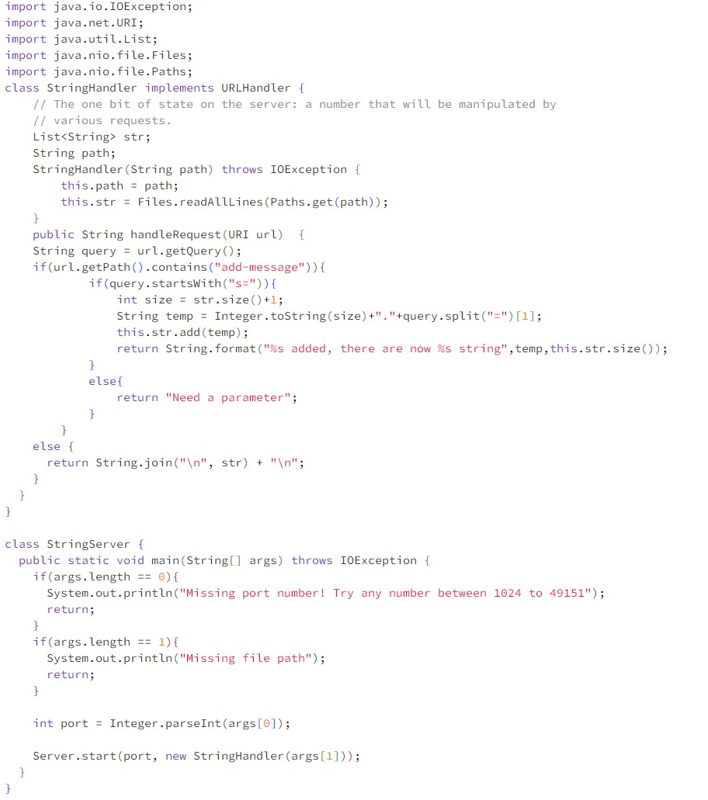
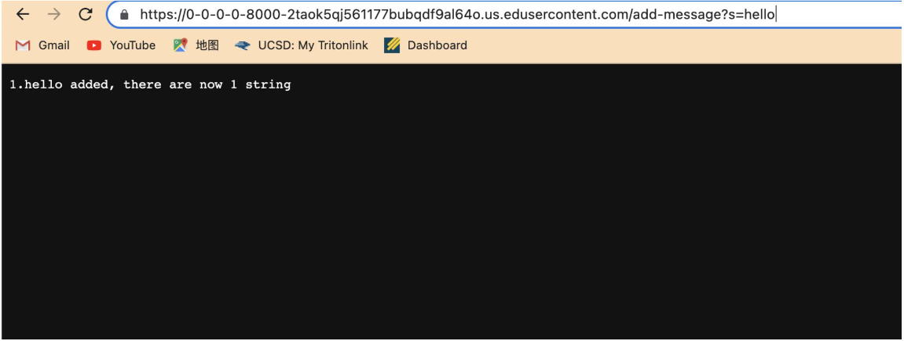
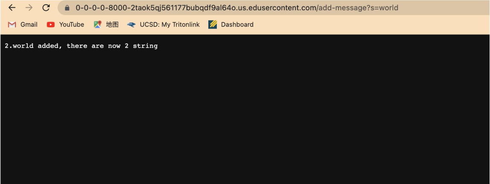
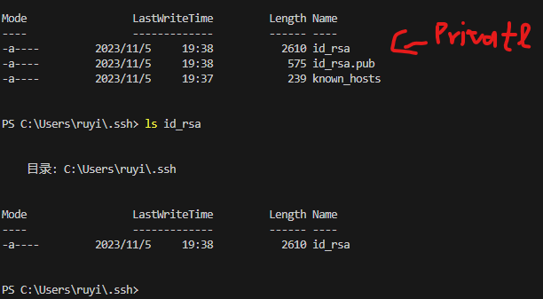
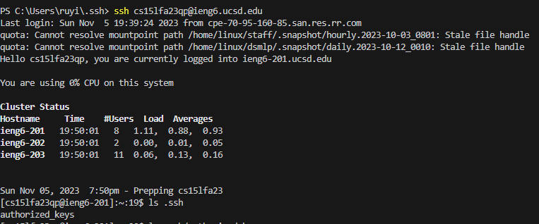

# Part 1

*The HandlerRequest are called,  method take URI url as argument and read the path. When we sent the request(change the path)(add query)

*relevant field: List str, String path

*relevant argument: URI url

*Based on the request, the list str add string "Hello", and String path also change because the url changed, int size +1.

*The HandlerRequest are called,  method take URI url as argument and read the path. When we sent the request(change the path)(add query)

*Based on the request, the list str add string "world", and String path also change because the url changed, int size +1.

*relevant field: List str, String path

*relevant argument: URI url

# Part 2

# Part 3
In week2 and week3 lab, most of the content in lab is new to me. I learn how to start a server, and how to set up a server. Also how to use ssh link to account. If I use the ssh key, I don’t have to login to my account by using password all the times. 
